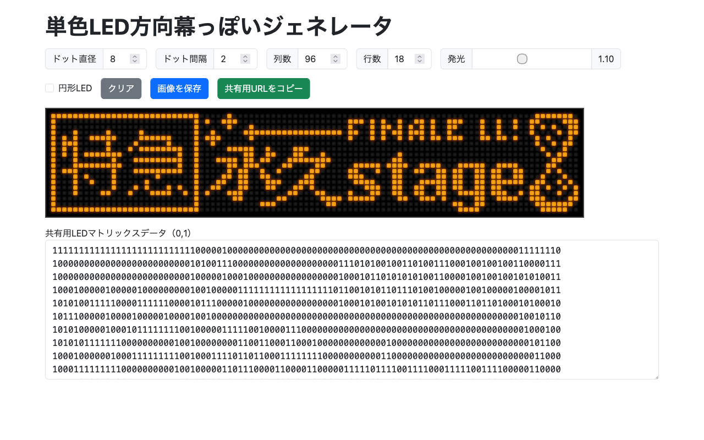

# 単色LED方向幕っぽいジェネレータ 

これは、単色 LED の方向幕（行先表示器）を再現するためのドット絵ツールです。

[2025年6月21日に行った「【特急】永久stage」企画](https://umineco.org/news/20250621/aqours_finale_lovelive_charter_bus)で、 Finale ライブのロゴを再現した行先表示器風のボードを作るために作成しました。

「ジェネレータ」という名前がついてますが、文字から自動的に生成することはできず、すべて自分で打ち込む必要があります。

## License

[MIT License](LICENSE)

## Copyright

&copy; 2025 windyakin
